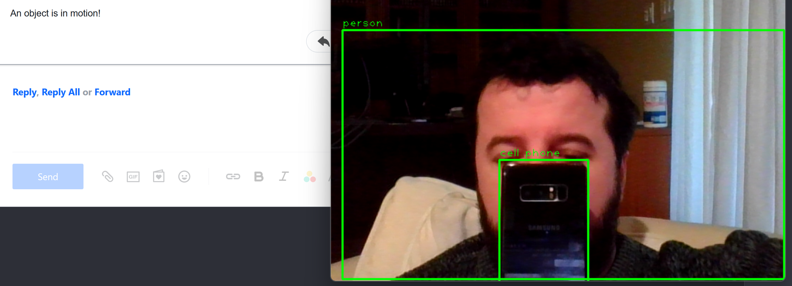

# Object Detection with Email Notification and Audio-Video Recording



This project uses YOLOv4 (You Only Look Once) real-time object detection algorithm to detect objects in a video feed. It records audio and video clips, and sends email notifications with the latest recorded clips as attachments when an object in motion is detected.

## Table of Contents

- [Object Detection with Email Notification and Audio-Video Recording](#object-detection-with-email-notification-and-audio-video-recording)
  - [Table of Contents](#table-of-contents)
  - [Introduction](#introduction)
  - [Requirements and Installation](#requirements-and-installation)

## Introduction

This project utilizes the YOLOv4 Tiny model for object detection in a video feed. When an object in motion is detected, it records a 5-second audio and video clip, sends an email notification with the latest clips attached, and stores object detection information in a local SQLite database.

## Requirements and Installation

To run this project, you need Python 3.7 or higher and the following libraries:

1. OpenCV (cv2)
2. NumPy
3. smtplib
4. email (built-in)
5. sqlite3 (built-in)
6. os (built-in)
7. time (built-in)
8. PyAudio
9. wave (built-in)
10. threading (built-in)

Install the required libraries using `pip`:

```bash
pip install opencv-python opencv-python-headless numpy PyAudio
